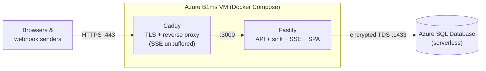

# Web Basket

A request bin / webhook inspector: create a basket, point any HTTP request at its URL, and watch requests appear on a live dashboard, with method, path, headers, and raw body captured byte-for-byte whatever the content type.

**Live demo:** _coming soon_ · **Stack:** TypeScript · Fastify · React · Azure SQL · Docker · Caddy · GitHub Actions

## What it does

- **Create a basket** and you get an unguessable URL like `https://<domain>/aB3xK9mQp2Zt`.
- **Send anything at it**: any method, sub-path, query string, or content type (malformed JSON and binary bodies included). The sink records the request and returns `204`.
- **Watch it live**: the dashboard at `/b/<address>` streams new requests over Server-Sent Events instead of polling.
- **Inspect and reuse**: pretty-printed JSON bodies, expandable headers, copy-as-cURL for replaying a request against your real endpoint, and download-as-JSON.

No accounts. The basket URL is the only credential (a 12-character base62 token from a CSPRNG, about 71 bits of entropy), your browser's `localStorage` remembers the baskets you created, and idle baskets expire after 7 days.

## Architecture



One Fastify process serves four surfaces, resolved in strict precedence order:

1. `/api/*`: the JSON API (zod-validated on both request _and_ response) plus the SSE stream
2. Static SPA assets, registered as one route per built file so nothing else is shadowed
3. **The sink**: if the first path segment is an existing basket address, record the request
4. SPA fallback: browser navigations (`Accept: text/html`) get `index.html`; everything else 404s

Live updates: the sink writes to the database inside one transaction (insert, bump activity, ring-buffer prune), then fans the record out to an in-memory `address → Set<connection>` SSE registry. The client subscribes _before_ fetching history and dedupes by id, so a request arriving during page load is never lost, and reconnects heal their own gaps by refetching.

## Monorepo layout

```
packages/shared/   zod schemas + inferred types (the FE/BE wire contract),
                   isomorphic base64/UTF-8 helpers, the cURL builder
apps/server/       Fastify: API, sink, SSE, static serving, migrations,
                   retention sweep; mssql connection pool; T-SQL
apps/web/          Vite + React SPA: home, live dashboard, localStorage
e2e/               one Playwright smoke: create → view → live-append
```

The shared package exports TypeScript source directly, so nothing ever compiles against a stale build. `tsc --noEmit` typechecks everywhere; tsup bundles the server and Vite bundles the SPA.

## Design decisions

- **Capability URLs, no auth.** The address _is_ the credential, so it must be unguessable (CSPRNG, 71 bits) and impossible to enumerate (there is no list-all endpoint; "your baskets" lives in `localStorage`).
- **Truncate, don't reject.** Oversized bodies are stored up to `BODY_MAX_BYTES` and flagged `truncated`, because a request bin that 413s big webhooks hides exactly what you're debugging.
- **The sink never rejects a payload.** Its plugin scope replaces all body parsers with a raw byte collector (Fastify encapsulation) while `/api` keeps strict JSON parsing.
- **Abuse limits by construction.** Rate limiting is registered inside the API plugin scope and applies only to basket creation, so the sink can never be throttled; a per-basket ring buffer (200) and TTL expiry (7 days) bound storage.
- **Trust matches topology.** `TRUST_PROXY` is off by default; in prod the app trusts `X-Forwarded-For` only because it's unreachable except through Caddy (no published ports).
- **Copy-as-cURL is a security surface.** Header and body values come from arbitrary internet requests, so the builder POSIX-quotes everything (`'\''`), uses `--data-raw` (no `-d @file` expansion), and skips hop-by-hop headers.

## Run it locally

Prereqs: Node ≥ 22 (with corepack), Docker.

```bash
corepack enable                                   # pins pnpm via packageManager
pnpm install
docker compose -f docker-compose.dev.yml up -d --wait   # SQL Server 2022 (dev parity)
pnpm --filter @web-basket/server db:migrate       # create + migrate the dev DB
pnpm --filter @web-basket/server dev              # Fastify on :3000
pnpm --filter @web-basket/web dev                 # Vite on :5173 (proxies /api)
```

Open http://localhost:5173, create a basket, then throw requests at it:

```bash
curl -X POST 'http://localhost:3000/<address>/anything?x=1' \
  -H 'content-type: application/json' \
  --data-raw '{"hello":"basket"}'
```

### Tests

```bash
pnpm test        # 111 unit + integration tests; needs the SQL Server container running
pnpm test:e2e    # Playwright smoke against the BUILT app (prod shape)
pnpm typecheck && pnpm lint
```

Pure logic gets unit tests; the server is tested against a real database engine (repositories, routing precedence, truncation, SSE over a live socket, none of it mocked); one end-to-end test covers the money path in a real browser. CI runs the same suites against the same engine via a service container.

## Deployment

Every push to `main` runs CI: lint, typecheck, the 111 tests, and the Playwright smoke, all against a SQL Server service container. On success, the deploy workflow builds the multi-stage image, pushes it to GHCR tagged `:latest` and `:sha` (the sha tag is the rollback handle), then SSHes to the VM and runs `docker compose pull && docker compose up -d`. Migrations run on server boot. Secrets live in an untracked `.env` on the VM; nothing sensitive is committed or baked into images.

Production is a single Azure **B1ms** VM running two containers, Caddy (automatic Let's Encrypt TLS, `flush_interval -1` so SSE streams unbuffered) and the app (non-root, 333 MB image), talking to **Azure SQL Database** on the serverless free tier.

> **Demo note:** serverless Azure SQL auto-pauses when idle, so the first request after a quiet period takes 30-60 seconds while the database resumes. The app raises its connect timeout to ride that out, and the pause is what keeps the demo effectively free.

## Limitations & future work

- **Single instance by design.** SSE fan-out and rate-limit counters are in-memory; scaling out would move both behind Redis (pub/sub plus a shared store).
- **Bodies live in the database**, capped at 256 KB. Raising the cap would mean moving bodies to Azure Blob Storage with a pointer in the row.
- Azure Key Vault for secrets, request replay from the UI, custom sink responses, search/filter, and the native `json` column type are all future work.
